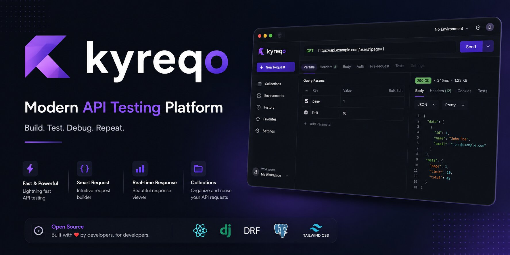
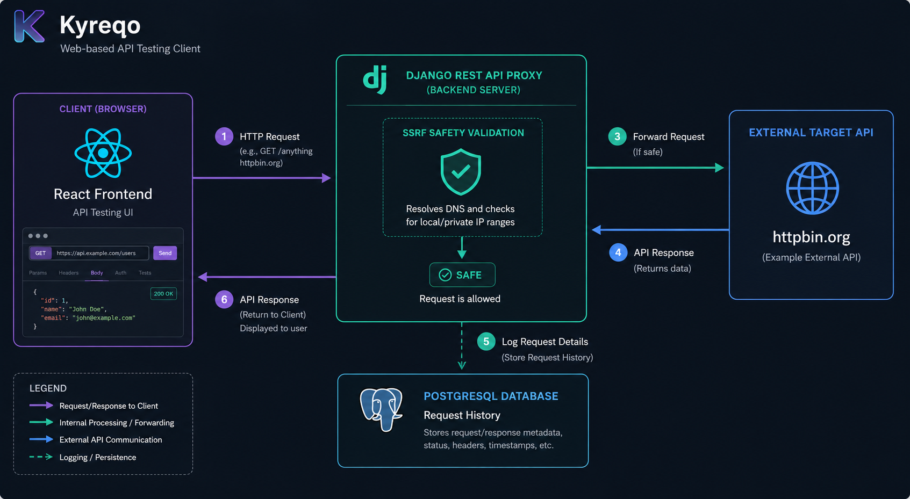

  

  A modern, open-source web-based API testing client designed for fast, safe, and collaborative API request design.

  
  
  
  
  

## ✨ Features

*   **🗂️ Workspaces:** Keep your projects organized with isolated environments and collections.
*   **📂 Collections & Requests:** Build, order, and save your API requests into folders.
*   **🔐 Environment Variables:** Define, switch, and reference dynamic variables easily across your headers and bodies.
*   **↺ Quick Restore & History:** Auto-save request history and instantly restore previous request parameters with a single click.
*   **🛡️ SSRF-Hardened Proxy:** Run requests securely through a backend proxy that blocks Server-Side Request Forgery (SSRF) bypasses and bypasses client CORS blocks.

---

## 📐 Architecture Overview

To resolve CORS and secure outgoing requests, Kyreqo routes API calls through a secure Django REST API Proxy. The backend resolves the target domain and verifies the IP against private/local network ranges before executing the request.

Below is the request-response lifecycle:

  

---

## 🔗 Quick Links

*   🛠️ **[Local Setup & Developer Guide](CONTRIBUTING.md)**
*   🔒 **[Security Policy](SECURITY.md)**
*   🤝 **[Code of Conduct](CODE_OF_CONDUCT.md)**
*   📄 **[MIT License](LICENSE)**
